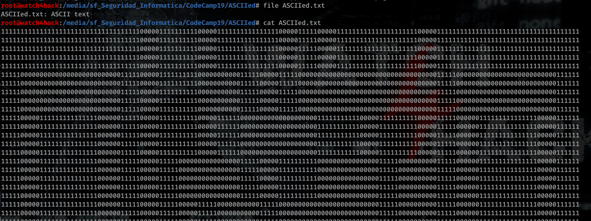
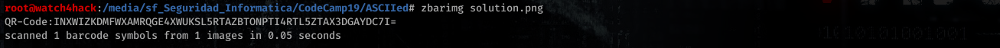
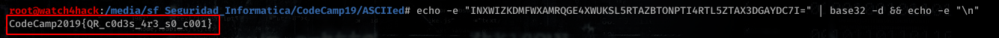

# **Resolución del reto "ASCIIed"**

**Pista: "Quizás sea de ayuda un pequeño script, existen librerías simples de tratamiento de imágenes.**

- **1**. Si vemos el contenido del archivo, vemos que se trata de un monton de unos y ceros. Si reducimos el zoom del terminal podemos ver que se trata de un QR.

- **2**. Crear script para pasar de QR ASCII a una imagen. En nuestro caso es el script ["*ASCII2QR.py*"](ASCII2QR.py)

- **3**. Ejecutamos el script y obtenemos el QR en imagen. Tras esto utilizamos alguna herramienta para leer códigos QR (como puede ser la herramienta zbarimg del paquete zbar-tools).

- **4**. Hemos obtenido un texto, al parecer se trata de una base 32, lo decodificamos y obtenemos la flag.

**Flag -> CodeCamp19{QR_c0d3s_4r3_s0_c001}**
