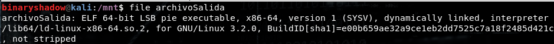
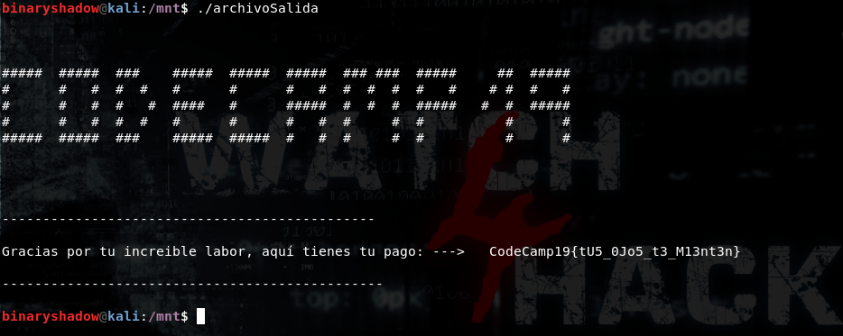

# **Resolución del reto "Bixel2Pit"**

**Pista: "El píxel es en una imagen a lo que un bit en un archivo informático".**

- **1**. Realizamos un "**compare -compose**" a las imágenes para ver en que se diferencian -> *compare -compose src img1.png img2.png diferencias.png*

- **2**. En la imagen "**diferencias.png**" se puede apreciar que hay datos ocultos en las imágenes. Como se solicita en la descripción del reto que se busque el ejecutable de un programa, se puede llegar a la conclusión de que las diferencia entre las imágenes representan los bits del propio ejecutable. Estos bits representan un ejecutable ELF, siguiendo la estructura propia de los mismos.
  

- **3**. Programamos un pequeño programa que recorra ambas imágenes, compare los píxeles y guarde en un archivo el resultado de dicha comparación. Siendo un 1 cuando existan diferencias en el pixel y 0 cuando sean iguales. (En nuestro caso hemos desarrollado el siguiente script en python ["*recuperar_archivo_pixeles.py*"](
https://github.com/Watch4Hack/CodeCamp19/blob/master/Bitsxl2Pit/resolution/recuperar_archivo_pixeles.py))

- **4**. Ejecutamos el programa implementado y guardamos su salida en un fichero -> *python recuperar_archivo_pixeles.py img1.png img2.png archivoSalida*

- **5**. Utilizamos file para comprobar que tipo de archivo es el que se a obtenido, podemos ver que se trata de un ELF (un ejecutable como nos solicitaban) -> *file archivoSalida*
  

- **6**. Damos permisos de ejecución al archivo, lo ejecutamos y obtenemos la Flag (la cual al ser generada en tiempo de ejecución no es posible de obtener mediante otro proceso que ejecutando el archivo).
  

  **Flag -> CodeCamp19{tU5_0Jo5_t3_M13nt3n}**
