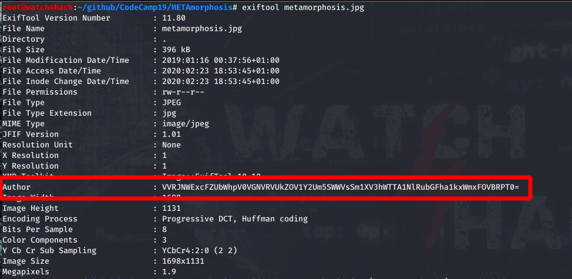
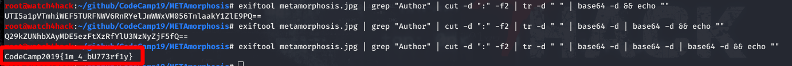

# **Resolución del reto "METAmorphosis"**

**Pista: "Algunas imágenes contienen información interesante en sus metadatos."**

- **1**. Las letras en mayúsculas en el título del reto nos sugiere que la solución está en los metadatos, utilizamos **exiftool** para verlos y vemos que en atributo "*Author*" tiene por valor un base 64.

- **2**. Si decodificamos el base 64 vemos que se trata de otro base 64, decodificamos las base 64 resultantes hasta obtener la flag.

  **CodeCamp2019{1m_4_bU773rf1y}**
