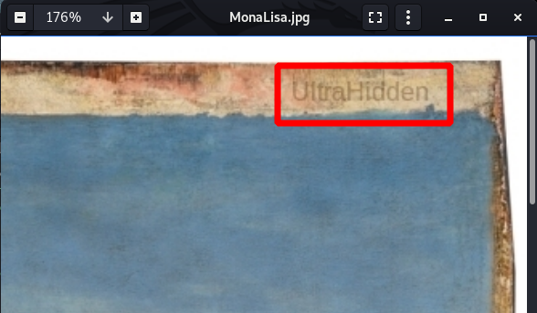

# **Resolución del reto "MonaLisa"**

**Pista: "Amplia la imagen si es necesario. A veces puedes añadir archivos dentro con un password de por medio."**

- **1**. Abrimos la imagen y a simple vista en el margen superior derecho se aprecia algo, ampliamos la imagen y vemos el texto: UltraHidden

- **2**. Obtenemos mensaje secreto de dentro de la imagen utilizando la contraseña que hemos encontrado: **steghide extract -sf MonaLisa.jpg**. Vemos el contenido del texto y obtenemos la credenciales (la flag).

  **CodeCamp2019{CEO_CodeCamp2019:4ny0n3C4nH4ckM3}**
