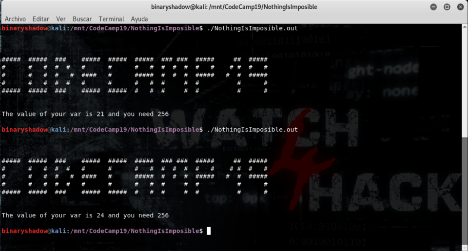
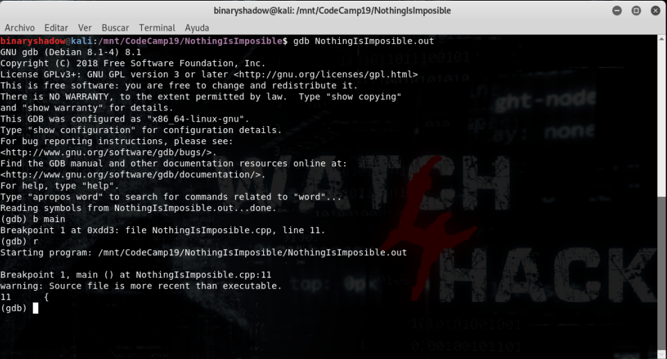
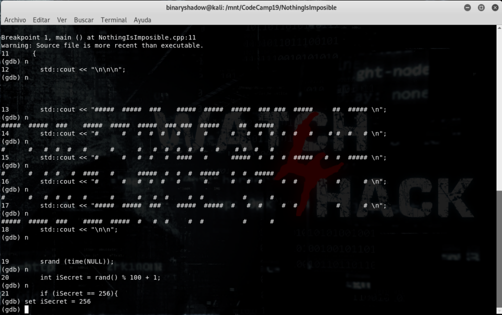
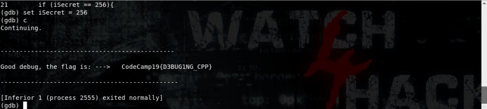

# **Resolución del reto "NothingIsImposible"**

- **1**.  Se nos proporcionan dos archivos, un archivo .cpp con la mitad del código de un programa en C++ y el ejecutable compilado. Si analizamos el código encontramos que  hay una condición "*if*" que comprueba si el valor de la variable "*iSecret*" es igual a 256, cosa que nunca sucederá porque su valor máximo solo podrá ser 100.

        #include <stdio.h>      /* printf, scanf, puts, NULL */
        #include <stdlib.h>     /* srand, rand */
        #include <time.h>       /* time */
        #include <string.h>
        #include <iostream>        // Instrucciones declarativas.
        using namespace std;

        char myword[] = { '3', 'D', 'B', 'U', '1', 'N', 'C' , 'G', '$', 'P', 'R'};

        int main()
        {
        std::cout << "\n\n\n";
        std::cout << "#####  #####  ###    #####  #####  #####  ### ###  #####     ##  ##### \n";
        std::cout << "#      #   #  #  #   #      #      #   #  #  #  #  #   #    # #  #   # \n";
        std::cout << "#      #   #  #   #  ####   #      #####  #  #  #  #####   #  #  ##### \n";
        std::cout << "#      #   #  #  #   #      #      #   #  #     #  #          #      # \n";
        std::cout << "#####  #####  ###    #####  #####  #   #  #     #  #          #      # \n";
        std::cout << "\n\n";
        srand (time(NULL));
        int iSecret = rand() % 100 + 1;
        if (iSecret == 256){

- **2**. Si ejecutamos el programa obtenemos siempre una salida similar a la siguiente:
  

- **3**. Dado que tenemos el ejecutable y parte del código, utilizaremos *GDB* (la pista a solicitar en este reto era la siguiente:"*Girondins de Bordeaux*" te será de ayuda en esta prueba, dando a entender, si cogíamos la primera letra de cada palabra, que debía utilizarse *GDB*)  para intentar entrar a la fuerza dentro del bloque del "*if*" y así conseguir la ejecución esperada. Primero ejecutamos GDB y ponemos un *breakpoint* en la función *main* del programa:
  

- **4**. Avanzamos en la ejecución, paso a paso, hasta llegar a la sentencia "*if*", donde modificamos mediante set el valor de la variable "*iSecret*" para que sea 256:
  

- **5**. Tras modificar el valor de la variable, dejamos que termine de ejecutarse el software, obteniendo así la _**flag**_ de este reto.
  

  **Flag -> CodeCamp19{D3BUG1NG_CPP}**
