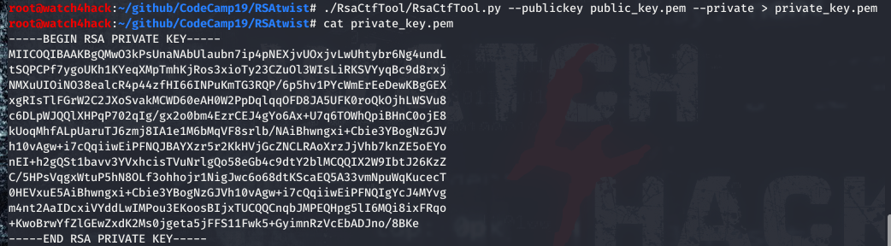

# **Resolución del reto "RSAtwist"**

**Pista: "Existe cierta herramienta para derivar la clave privada de una clave pública si es computacionalmente vulnerable.*

- **1**. Obtenemos clave privada con RsaCtfTool (existen otras herramientas para derivar la clave privada de una pública cuando se está utilizando una clave con una longitud computacionalmente débil): *python RsaCtfTool.py --publickey public_key.pem --private > private_key.pem*

- **2**. Desciframos el archivo con la clave privada y obtenemos la flag: *openssl rsautl -decrypt -inkey private_key.pem -in flag.enc -out flag.txt*

  **CodeCamp2019{512_bits_pubkey_is_not_secure}**
