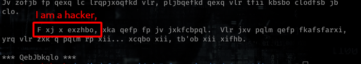
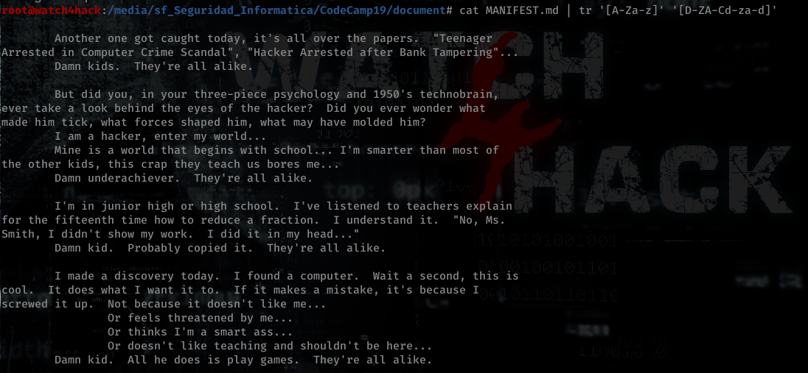

# **Resolución del reto "document"**

**Pista: "Existen varios métodos de cifrado clásicos que hacen uso del desplazamiento de carácteres.**

- **1**. Si vemos el contenido del archivo podemos observar que se trata de algún tipo de cifrado. Estudiando podemos ver que se trata de un cifrado Cesar donde se desplaza 3 caracteres.

- **2**. Podemos utilizar el comando tr para decodificarlo o herramientas externas como Cyberchef (es un ROT13 con desplazamiento de 3). Tras ello obtenemos el texto decodificado: ["*solucion.txt*"](solucion.txt)

**Flag -> CodeCamp2019{TheMentor}**
