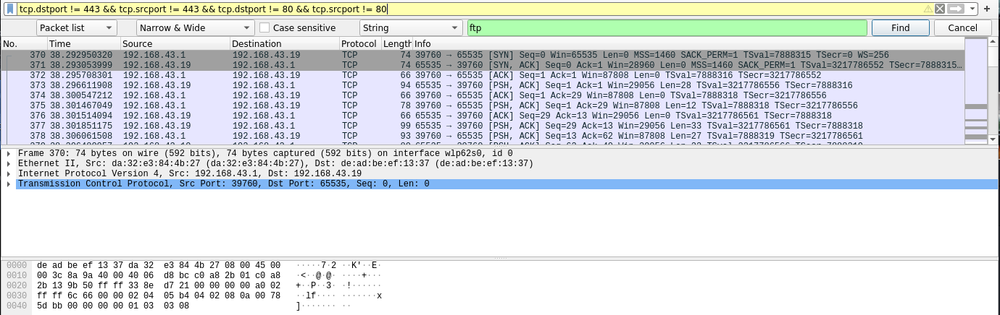
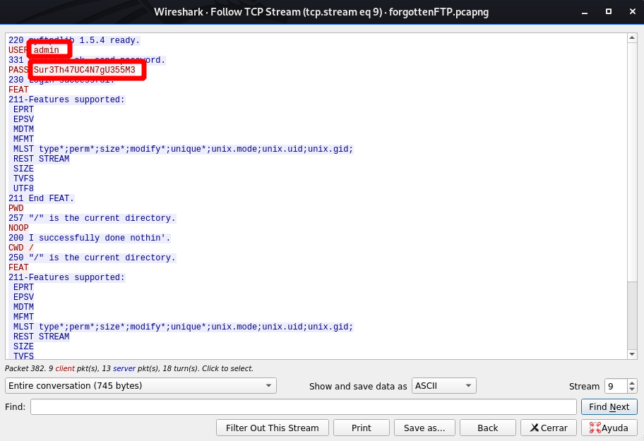

# **Resolución del reto "forgottenFTP"**

**Pista: "Los servidores FTP no siempre se encuentran en el puerto por defecto [21]**

- **1**. Abrimos el archivo pcapng con Wireshark.

- **2**. Tenemos mucho tráfico que no nos sirve para nada, concretamente conexiones a HTTPS (puerto 443), filtramos para que no nos aparezcan estos paquetes, también hay algunas peticiones a HTTP y podemos tambien filtrarlas. Aplicando el filtro "**tcp.dstport != 443 && tcp.srcport != 443 && tcp.dstport != 80 && tcp.srcport != 80**" obtenemos un solo la comunicación hacia un servicio en el puerto 65535 de uno de los hosts:

- **3**. Hacemos click derecho sobre uno de los paquetes y seleccionamos la opción **Follow -> TCP Stream**, con ello veremos la comunicación con el servicio FTP y en ella el usuario y el password que se han filtrado.

  **CodeCamp2019{admin_Sur3Th47UC4N7gU355M3}**
