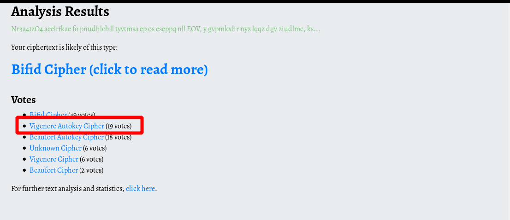
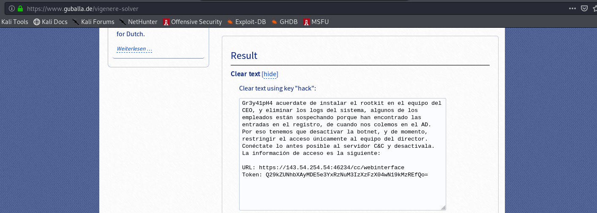
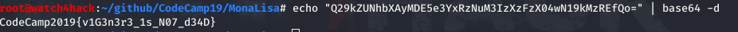

# **Resolución del reto "intercepted"**

**Pista: "El tipo de cifrado utilizado ha sido de sustitución polialfabético."**

- **1**. Analizando el texto vemos que se trata de un cifrado por sustitución, podemos utilizar distintas webs para que nos sugiera el tipo de cifrado a utlizar, por ejemplo: *https://www.boxentriq.com/code-breaking/cipher-identifier*, o probar con los que creemos que pueden ser (en este caso se trata de un cifrado vigenere).

- **2**. Con alguna web que nos permita romper el cifrado Vigeniere obtenemos el texto en claro (por ejemplo: *https://www.guballa.de/vigenere-solver*)

- **2**. Vemos que el token es un base 64, lo decodificamos y obtenemos la flag:

  **CodeCamp2019{v1G3n3r3_1s_N07_d34D}**
