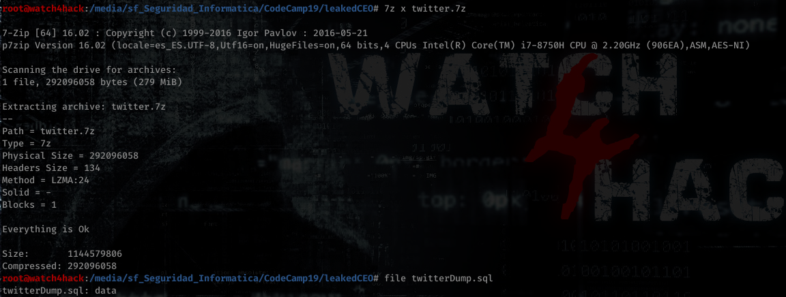
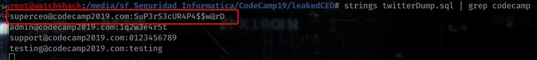

# **Resolución del reto "leakedCEO"**

**Pista: "Las expresiones regulares y utilidades de linux, te pueden facilitar la tarea.**

- **1**. Antes de nada descomprimimos el archivo twitter.7z.

- **2**. Vemos el el archivo de dentro tiene extensión sql pero no es un archivo de base de datos válido. Lo que podemos usar es string para ver su contenido y veremos que tiene una gran cantidad de correos y sus contraseñas.

- **3**. Dado que estabamos que la entidad que nos solicita realizar este trabajo es la CodeCamp, podemos asumir que su dominio contiene este texto. Por tanto unicamente precisamos utilizar el comando *strings* y filtrar la salida con *grep* para obtener los correos que contengan este texto. La primera linea en imprimirse es el correo del CEO que buscábamos.

**Flag -> CodeCamp19{superceo@codecamp2019.com:SuP3rS3cUR4P4$$w@rD}**
